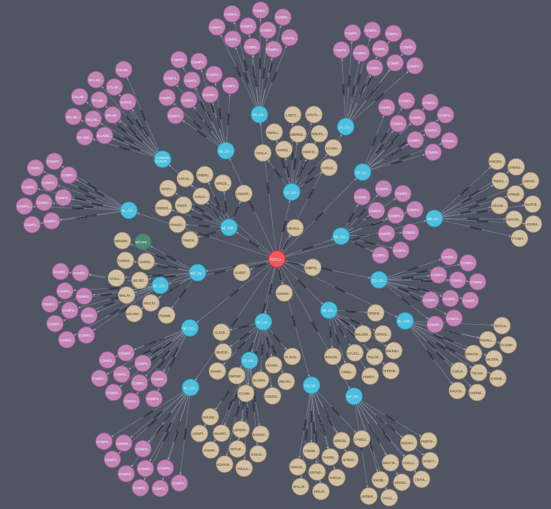
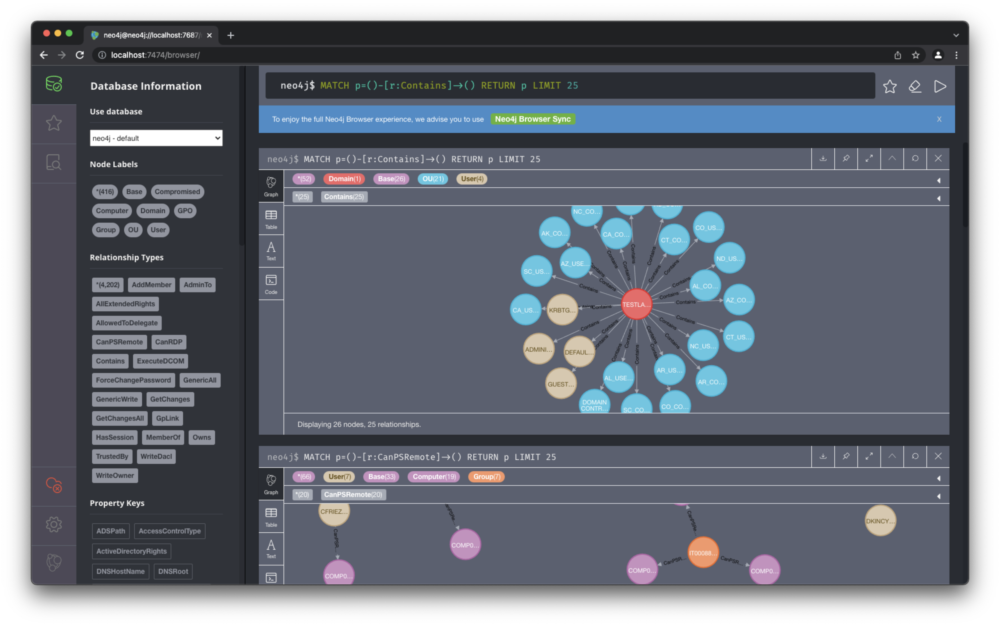

# adsimulator: a realistic simulator of Active Directory domains

```
      ,.,
      MMMM_    ,..,
        "_ "__"MMMMM          ,...,,
 ,..., __." --"    ,.,     _-"MMMMMMM
MMMMMM"___ "_._   MMM"_."" _ """"""   _     _                 _       _               
 """""    "" , \_.   "_. ."  __ _  __| |___(_)_ __ ___  _   _| | __ _| |_ ___  _ __    
        ,., _"__ \__./ ."   / _` |/ _` / __| | '_ ` _ \| | | | |/ _` | __/ _ \| '__|   
       MMMMM_"  "_    ./   | (_| | (_| \__ \ | | | | | | |_| | | (_| | || (_) | | 
        ''''      (    )    \__,_|\__,_|___/_|_| |_| |_|\__,_|_|\__,_|\__\___/|_|  
 ._______________.-'____"---._.
  \                          /
   \________________________/
   (_)                    (_)
```

Author: Nicolas Carolo <nicolascarolo.dev@gmail.com>

Copyright: © 2022, Nicolas Carolo.

Date: 2022-06-29

Version: 1.1.1


## PURPOSE
`adsimulator` is a graph-based tool for the simulation of realistic Active Directory environments. The graph models are generated according to a customizable list of requirements and represent the relationships between the nodes of an Active Directory domain. Finally, graphs are stored in a Neo4j graph database instance. This tool is inspired by [DBCreator](https://github.com/BloodHoundAD/BloodHound-Tools), but it provides more features.

The ability to generate graphs according to specific requirements is the most relevant functionality offered by `adsimulator`. For example, it is possible to generate environments affected by vulnerabilities (e.g., various types of ACL misconfigurations, inadequate security policies) that make them possible targets of cyber-attacks, such as AS-REP Roasting and DCSync. In addition, it is possible to choose the size of Active Directory environments by setting up the number of domain trusts, Security Principals, OUs, and GPOs. Moreover, it is possible to set the probabilities associated with object properties.

The following table summarizes the most relevant parameters used in the generation of an Active Directory domain.

| Object   | Property          | Description                               | Value |
|----------|-------------------|-------------------------------------------|-------|
| ACL      | `ACLsProbability` | Probability of each access control right (e.g., `GenericAll`, `AddMember`, `WriteDacl`) | Integer for each right (0-100). The sum of the probabilities must be equal to 100
| Computer | `nComputers`      | Number of computers | Integer > 0 |
| Computer | `CanRDPFromUserPercentage` <br> `CanRDPFromGroupPercentage` | Maximum percentage of computers with CanRDP edges from users groups. | Integer (0-100) |
| Computer | `CanPSRemoteFromUserPercentage` <br> `CanPSRemoteFromGroupPercentage` | Maximum percentage of computers with `CanPSRemote` edges from users groups | Integer (0-100) |
| Computer | `ExecuteDCOMFromUserPercentage` <br> `ExecuteDCOMFromGroupPercentage` | Maximum Percentage of computers with `ExecuteDCOM` edges from users groups | Integer (0-100) |
| Computer | `AllowedToDelegateFromUserPercentage` <br> `AllowedToDelegateFromComputerPercentage` | Maximum percentage of users computers with `AllowedToDelegate` edges | Integer (0-100) |
| Computer <br> DC <br> User | `enabled` | Probability that an object is enabled | Integer (0-100) |
| Computer <br> User | `unconstraineddelegation` | Probability that an object has unconstrained delegation enabled | Integer (0-100) |
| Computer <br> DC | `osProbability` | Probability of each OS version | Integer for each OS version (0-100). <br> The sum of the probabilities must be equal to 100 |
| Domain | `functionalLevelProbability` | Probability of each functional level value | Integer for each functional level (0-100). <br> The sum of the probabilities must be equal to 100 |
| Domain | `Trusts` | Number of Inbound, Outbound and Bidirectional trusts | Integer >= 0 |
| GPO | `nGPOs` | Number of GPOs | Integer > 0 |
| Group | `nGroups` | The number of groups | nteger > 0 |
| OU | `nOUs` | Number of OUs | Even integer > 0 |
| User | `nUsers` | Number of users | Integer > 0 |
| User | `dontreqpreauth` | Probability that a user has Kerberos pre-authentication disabled | Integer (0-100) |
| User | `hassp` | Probability that a user has a SPN | Integer (0-100) |
| User | `passwordnotreqd` | Probability that a user does not have a login password | Integer (0-100) |
| User | `pwdneverexpires` | Probability that a user’s password never expires | Integer (0-100) |
| User | `sidhistory` | Probability that a user previously belonged to another domain | Integer (0-100) |

## Structure of simulated Active Directory domains

The graph generated by `adsimulator` contains **nodes** and **edges**. Nodes represent the domain objects, while edges represent the relationships between objects.

Nodes represent the following Active Directory objects:
* Domains
* Organizational Units (OUs)
* Groups
* Users
* Computers
* Group Policy Objects (GPOs)

Edges represent the following relationships:
* **Domain/OU to OU, Domain/OU to Security Principal**: `Contains`
* **Domain to Domain**: `TrustedBy`
* **Security Principal to Group**: `AddMember`, `MemberOf`
* **Security Principal to Computer**: `AdminTo`, `CanPSRemote`, `CanRDP`, `ExecuteDCOM`
* **User to Computer**: `HasSession`
* **ACLs**: `AllExtendedRights`, `AddAllowedToAct`, `AllowedToAct`, `AllowedToDelegate`, `ForceChangePassword`, `GenericAll`, `GenericWrite`, `GetChanges`, `GetChangesAll`, `Owns`, `WriteDacl`, `WriteOwner`
* **GPO to Domain/OU**: `GpLink`

For more details about relationships, you can consult the official [BloodHound guide](https://bloodhound.readthedocs.io/en/latest/data-analysis/edges.html).

This graph shows an example of how users and computers are organized in Organizational Units and in the domain. Yellow nodes represent users, violet nodes represent computers, blue nodes are Organizational Units, and the red node is the domain. The green node denotes the compromised user who was exploited for enumerating the Active Directory domain represented by the graph model. Users and computers are contained in Organizational Units and Organizational Units are contained in the domain.




## MINIMUM REQUIREMENTS

## Supported OS
* Linux
* macOS

## Interpreter and tools
* Python 3
* Neo4j


## INSTALLATION

### Linux
1. Install **Neo4j**
2. Create a new Neo4j database instance with the following credentials:
   * Username: `neo4j`
   * Password: `password`
3. Install `apoc` plugin
4. Append the following lines to the settings file:
   ```
   apoc.import.file.enabled=true
   apoc.import.file.use_neo4j_config=false
   apoc.export.file.enabled=true
   ```
5. Install `adsimulator` running the following commands:
   ```sh
   git clone https://github.com/nicolas_carolo/adsimulator
   cd adsimulator
   ./installer_linux.sh
   pip install -r requirements.txt
   python setup.py install
   ```

### macOS
1. Install **Neo4j**
2. Create a new Neo4j database instance with the following credentials:
   * Username: `neo4j`
   * Password: `password`
3. Install `apoc` plugin
4. Append the following lines to the settings file:
   ```
   apoc.import.file.enabled=true
   apoc.import.file.use_neo4j_config=false
   apoc.export.file.enabled=true
   apoc.export.file.enabled=true
   ```
5. Install `adsimulator` running the following commands:
   ```sh
   git clone https://github.com/nicolas_carolo/adsimulator
   cd adsimulator
   ./installer_darwin.sh
   pip install -r requirements.txt
   python setup.py install
   ```


## USAGE

### Running
```
$ adsimulator
```

### Commands

* `dbconfig` - Set the credentials and the database URL
* `connect` - Connect to the database using supplied credentials
* `setparams` - Import the settings JSON file containing the parameters for the graph generation. Here, a [template](./docs/settings.json) you can use for customizing setting and generate different Active Directory models.
* `setdomain` - Set the domain name
* `cleardb` - Clear the database and set the schema properly
* `generate` - Connect to the database, clear the DB, set the schema, and generate the random graph model. If you use this command followed by a file path (e.g., `generate /tmp/testlab.json`), you can export the graph model as a JSON file.
* `about`: View information about the version of the software
* `update`: Check for updates 
* `exit` - Exit

### View generated graph models

The generated graph models are available at `http://localhost:7474/`, where we can execute Cypher queries for generating graphs. Here, [some examples of Cypher queries](./docs/cypher_queries.md).



## COPYRIGHT

Copyright © 2022, Nicolas Carolo.
All rights reserved.

Redistribution and use in source and binary forms, with or without
modification, are permitted provided that the following conditions are
met:

1. Redistributions of source code must retain the above copyright
   notice, this list of conditions, and the following disclaimer.

2. Redistributions in binary form must reproduce the above copyright
   notice, this list of conditions, and the following disclaimer in the
   documentation and/or other materials provided with the distribution.

3. Neither the name of the author of this software nor the names of
   contributors to this software may be used to endorse or promote
   products derived from this software without specific prior written
   consent.

THIS SOFTWARE IS PROVIDED BY THE COPYRIGHT HOLDERS AND CONTRIBUTORS
"AS IS" AND ANY EXPRESS OR IMPLIED WARRANTIES, INCLUDING, BUT NOT
LIMITED TO, THE IMPLIED WARRANTIES OF MERCHANTABILITY AND FITNESS FOR
A PARTICULAR PURPOSE ARE DISCLAIMED.  IN NO EVENT SHALL THE COPYRIGHT
OWNER OR CONTRIBUTORS BE LIABLE FOR ANY DIRECT, INDIRECT, INCIDENTAL,
SPECIAL, EXEMPLARY, OR CONSEQUENTIAL DAMAGES (INCLUDING, BUT NOT
LIMITED TO, PROCUREMENT OF SUBSTITUTE GOODS OR SERVICES; LOSS OF USE,
DATA, OR PROFITS; OR BUSINESS INTERRUPTION) HOWEVER CAUSED AND ON ANY
THEORY OF LIABILITY, WHETHER IN CONTRACT, STRICT LIABILITY, OR TORT
(INCLUDING NEGLIGENCE OR OTHERWISE) ARISING IN ANY WAY OUT OF THE USE
OF THIS SOFTWARE, EVEN IF ADVISED OF THE POSSIBILITY OF SUCH DAMAGE.


## CREDITS

The logo uses ASCII art created by Corwyn Yasuo Miyagishima.
