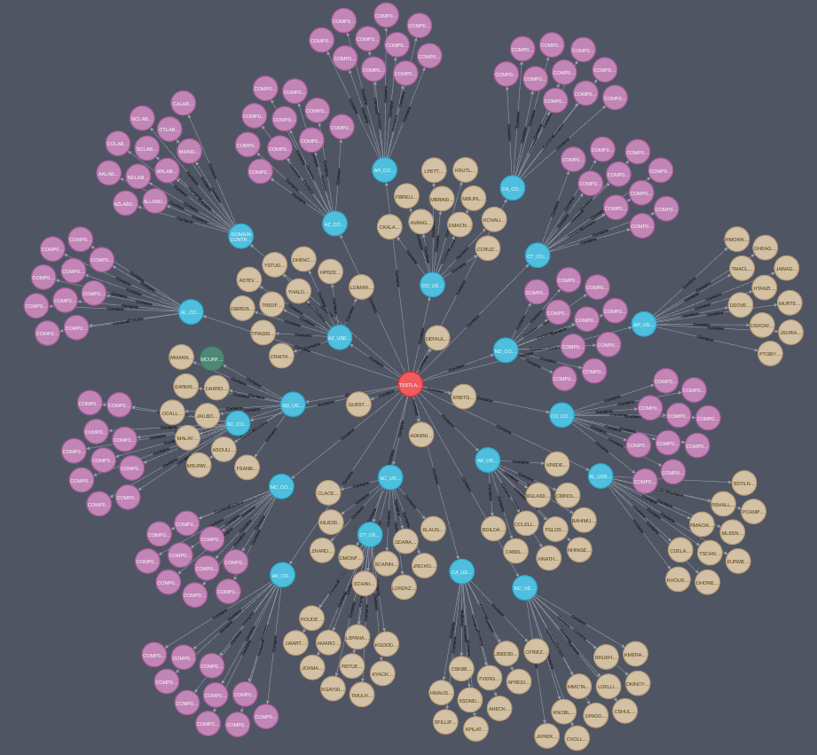

# Some examples of Cypher queries

## Structure of the Domain and its Organizational Units
```
MATCH p=()-[r:Contains]->() RETURN p
```

The graph shows how users and computers are organized in the Organizational Units and in the domain. Yellow nodes represent users, violet nodes represent computers, and blue nodes are Organizational Units. The green node denotes the compromised user who was exploited for enumerating the Active Directory domain represented by the graph model. Users and computers are contained in Organizational Units and Organizational Units are contained in the domain.



## Trust relationships between the domains belonging to the same forest:
```
MATCH p=()-[r:TrustedBy]->() RETURN p
```

The graph represents the **inbound**, **outbound** and **bidirectional trust relationships** between the `TESTLAB.LOCAL` domain and the other forest domains.


## Group Memberships:
```
MATCH p=()-[r:MemberOf]->() RETURN p
```

The graph shows the users and the computers that are members of the domain groups (orange nodes). Purple nodes on the top left are the computers that belong to the DOMAIN COMPUTERS group, while yellow nodes and the green one are the users that belong to the DOMAIN USERS group. Violet nodes on the right are the **Domain Controllers** that belong to the `DOMAIN CONTROLLERS` and to the `ENTERPRISE DOMAIN CONTROLLERS` groups.


## Users and groups that can open a PowerShell session on the domain computers
```
MATCH p=()-[r:CanPSRemote]->() RETURN p
```

The graph shows the users and the groups that can open a PowerShell session on a specific domain computer and execute remote commands.


## Shortest path from users to the `Domain Admins` group:
```
MATCH p=shortestPath((n:User)-[*1..]->(m:Group {name: 'DOMAIN ADMINS@ECORP.NICODOMAIN.PRV'}))
WHERE NOT n=m RETURN p
```


## Shortest path from the compromised user to the `Domain Admins` group:
```
MATCH p=shortestPath((n:Compromised)-[*1..]->(m:Group {name: 'DOMAIN ADMINS@ECORP.NICODOMAIN.PRV'}))
WHERE NOT n=m RETURN p
```
